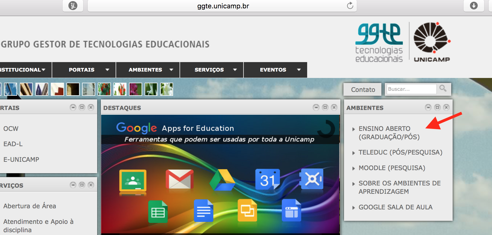
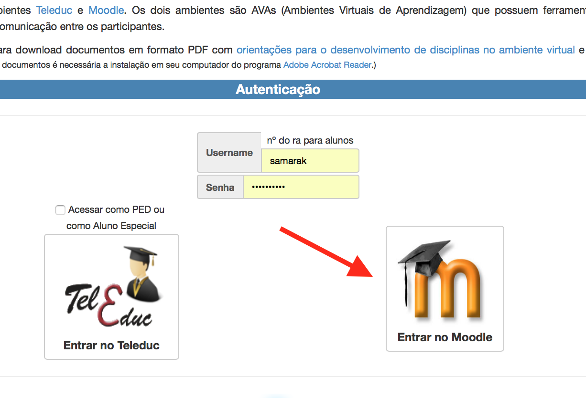
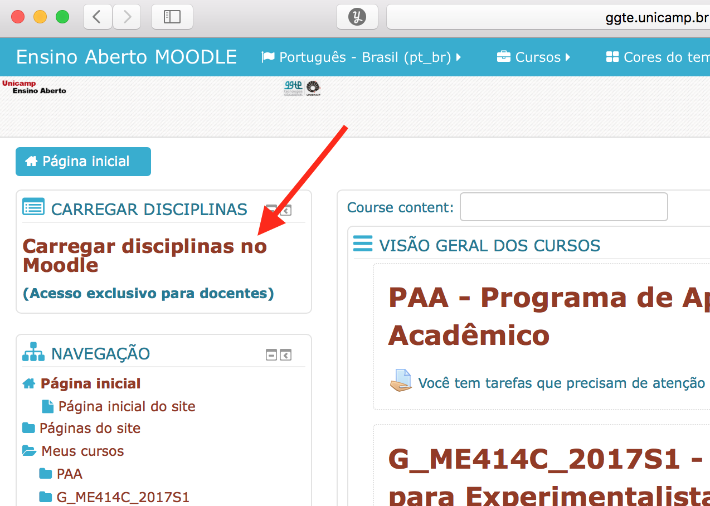

# Configurando turma no Moodle para ME414

### Abrir turma no Moodle

1- http://www.ggte.unicamp.br

2- Ambiente: Ensino Aberto

2- Login: usuário DAC

3- Carregar disciplinas

4- Escolher a disciplina, carregar, confirmar.

### 

