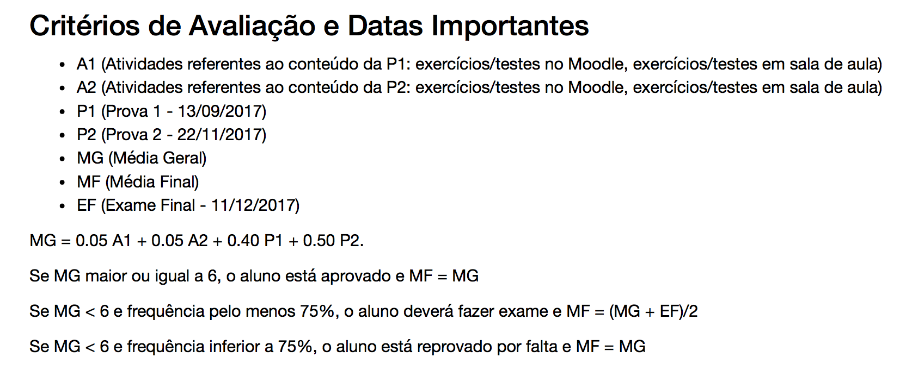

# Configurando turma no Moodle para ME414

### Abrir turma

1- http://www.ggte.unicamp.br

2- Ambiente: Ensino Aberto

2- Login: usuário DAC

3- Carregar disciplinas

4- Escolher a disciplina, carregar, confirmar.

### Configuração da turma

#### Comunicação com os alunos

A página já vem com o quadro de **Avisos** ativa, que pode ser usada para **mandar mensagens para toda a classe**.

Opcionalmente, selecionar: **Enviar email em seguida** (caso contrário o aluno só lerá a mensagem ao entrar no Moodle)

#### Lista de presença

1- Ative a edição:

2- Adicione o recurso:

3- Selecione **Presença**:

4- Nota **Nenhum**:

5- Salvar e retornar ao curso

6- Clique em **Presença**

7- Adicionar Sessão

8- Configure com a data inicial, horário inicial e final da aula e depois configure a sessão de repetição de sessões.

9- Em **Configurações** coloque 1 ponto para **Presente**, exclua **Atrasado**, **Dispensado**

10- Resultado:

11- Quando quiser fazer a chamada durante a aula, basta clicar em **Presença**, escolher a sessão e registrar presença.

#### Tópico de Informações Gerais

1- Renomeie o **Tópico 1** e depois clique em **Editar** caso queira colocar as informações diretamente.

2- Outra opção é colocar um pdf com as informações gerais, ou link para uma página, etc... Para isso, basta **adicionar uma atividade ou recurso**

#### Livro de Notas

A configuração deste exemplo se refere ao seguinte critério de avaliação:

**Prova 1**: adicione **item de nota**

Repita para **Prova 2**

**Atividade 1**: uma categoria (pasta) em que todas as atividades ficarão dentro desta categoria, com o mesmo peso cada.

Repita para **Atividade 2**

Crie a **Média Geral MG**, através de **adicione um ITEM de nota** e modifique a nota máxima para 10

Configure a fórmula de **MG**, mas primeiro:

Em seguinda, insira a fórmula:

Crie a **Média Final MG**, através de **adicione uma CATEGORIA de nota** e modifique a nota máxima para 10.

Crie o **Exame**, através de **adicione um ITEM de nota** e modifique a nota máxima para 10.

Coloque **MG** e **Exame** dentro da categoria **MF**.

Começando por **MG**:

Repita a mesma coisa para **Exame**. Resultado:

Oculte a coluna **Total do Curso**, pois não será utilizada.

**IMPORTANTE** : não preencha a coluna **Exame** para alunos que não ficaram de exame. Para os que ficaram de exame, mas não compareceram, preencha como 0. Desta maneira, a coluna **MF total** irá conter **MF** calculada corretamente automaticamente.

#### Inserindo Atividades

